# Experiment_No.1 : Installation Of Python

## Title: 
Introduction to Python Programming and Installation of Jupyter Notebook Using Anaconda

## Aim: 
To study the basics of Python programming language, understand the Python execution environment, install Python and Jupyter Notebook using Anaconda distribution, and explore various Python IDEs including Google Colab.

## Objectives:
* To understand Python features and applications
* To install Python and Jupyter Notebook using Anaconda
*	To explore Python IDEs and environments
*	To execute basic Python programs using Jupyter Notebook and Google Colab

## Theory: 
**1. Introduction to Python**
Python is a high-level, interpreted, and object-oriented programming language widely used for data analysis, machine learning, automation, and scientific computing.

**2. What is Anaconda?**
Anaconda is a free, open-source distribution of Python and R designed for data science and machine learning.

**Advantages of Anaconda:**
*	Comes with Python, Jupyter Notebook, Spyder, and libraries pre-installed
*	Easy package and environment management
*	Avoids dependency issues
*	Suitable for beginners and professionals

**Why python?**
1. Python is interpreter language.
2. Python is easiest language to learn.
3. Python is most important language for Cyber security, Data science, Data Analytics, Artificial Intelligence & Machine learning.

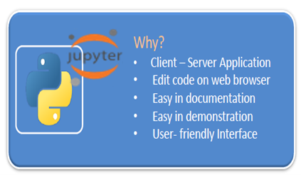

**Download Python : https://www.python.org/**

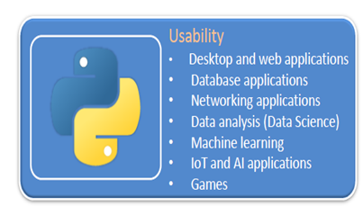

----

**Python Features :**
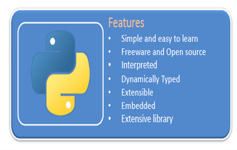

------

## Python Installation Process Step-by-Step:

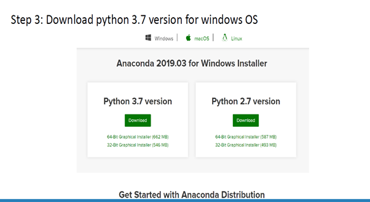
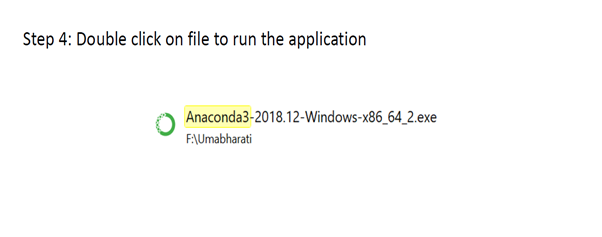
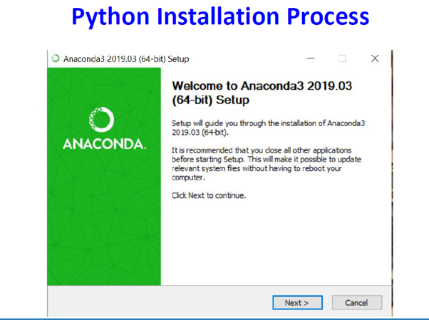
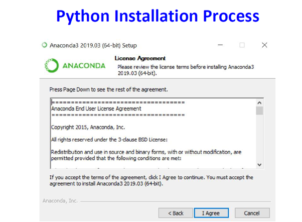

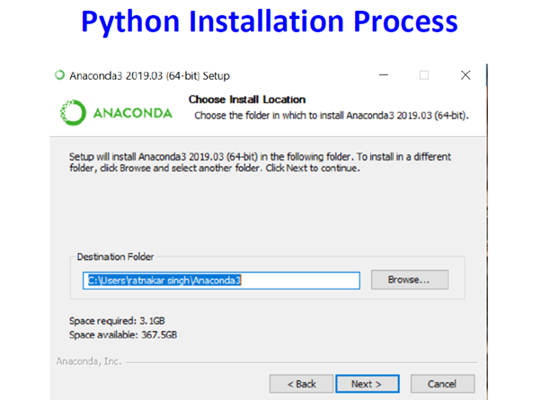
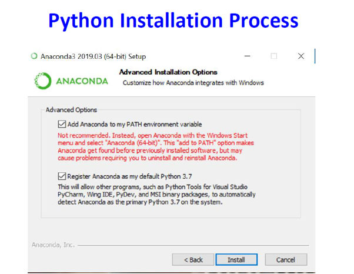
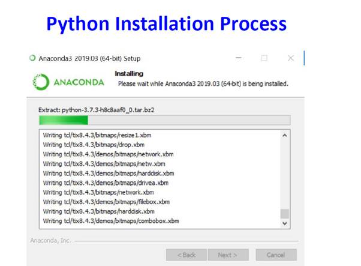
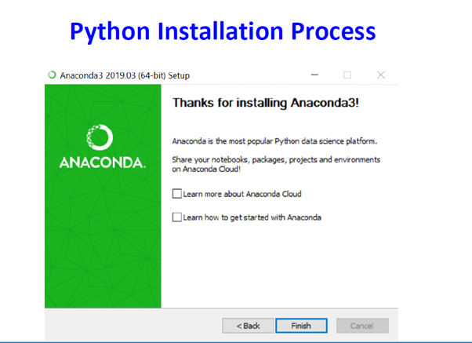
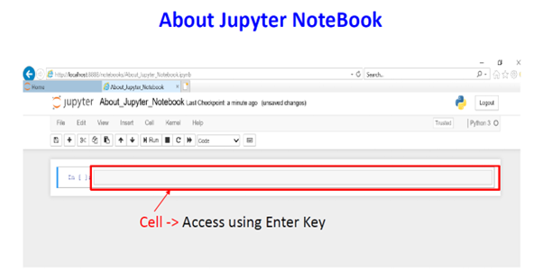
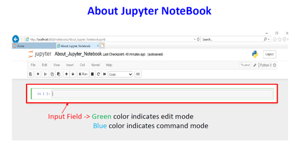
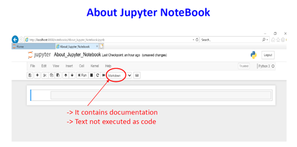

**Why Jupyter NoteBook?** 
* Cell by cell execution : You can run code in small parts, not all at once.
* Instant output : Output appears immediately below the code.
* Easy learning : Code + notes + output in one place.
* Great for beginners – It helps understand each step clearly.
* Best for Data Science & AI/ML – Widely used in data analysis, machine learning, deep learning.
* Easy debugging – You can fix and run only the error part.
* Supports text + code together – You can write explanations using Markdown.

**3. Installation of Anaconda and Jupyter Notebook**
Step-1: Download Anaconda
1.	Visit the official Anaconda website: https://www.anaconda.com
2.	Click on Download and select Anaconda Individual Edition.
3.	Choose Python 3.x version suitable for your operating system.
 
## Python IDEs:
IDE	Description
IDLE	Basic Python IDE
Spyder	Scientific Python IDE (Anaconda)
PyCharm	Professional Python IDE
VS Code	Lightweight code editor
Jupyter Notebook	Interactive EDA environment

## Google Colab
Google Colab is a cloud-based Python environment provided by Google.
Advantages:
•	No installation required
•	Free GPU/TPU access
•	Easy collaboration
•	Runs in browser

 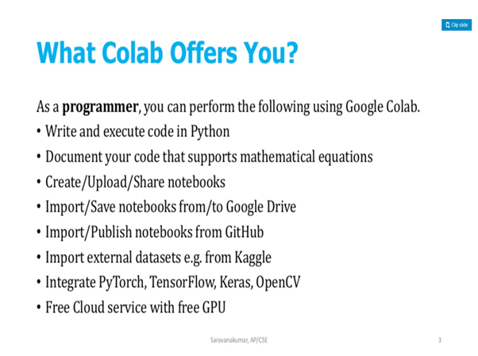
 
## Steps to Use Google Colab:
1.	Visit https://colab.research.google.com
2.	Sign in using Google account
3.	Create a new Python notebook

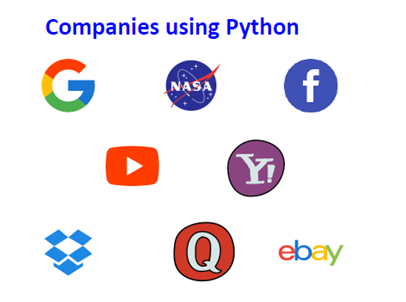

## Conclusion
Python provides a flexible and powerful programming environment. Jupyter Notebook and Google Colab simplify learning and exploratory data analysis by providing interactive execution and visualization support.
